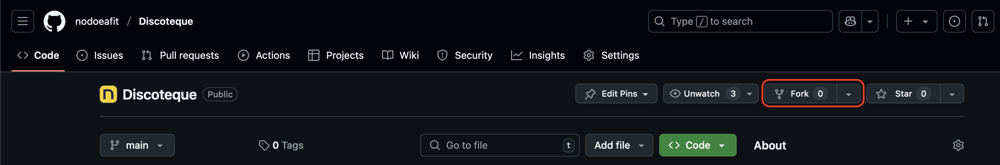

# Dotnet: The discoteque

## ¡Bienvenido a tu viaje por .NET y Docker! 🚀

¡Hola futuro desarrollador .NET! 

Estás a punto de embarcarte en una emocionante aventura de aprendizaje donde descubrirás el poder de .NET y Docker. No te preocupes si estos términos te suenan nuevos o intimidantes - todos empezamos desde cero en algún momento.

En este tutorial, aprenderás paso a paso cómo:
- Crear una API robusta con .NET
- Manejar bases de datos y operaciones CRUD
- Trabajar con contenedores usando Docker
- Implementar pruebas para asegurar la calidad de tu código

Recuerda: el aprendizaje es un proceso, y está bien cometer errores. ¡Cada error es una oportunidad para aprender algo nuevo!

## Preparando tu Espacio de Trabajo: Fork del Repositorio

Antes de comenzar, necesitarás crear tu propia copia del repositorio. Esto se hace mediante un "fork". Aquí te explicamos cómo:

1. En la parte superior derecha de la página del repositorio en GitHub, encontrarás el botón "Fork". ¡Haz clic en él!

   


2. GitHub te preguntará dónde quieres crear el fork. Selecciona tu cuenta de usuario.

3. Espera unos segundos mientras GitHub copia el repositorio a tu cuenta.

4. Una vez completado, tendrás tu propia versión del repositorio en tu cuenta de GitHub.

5. Ahora, clona el repositorio a tu máquina local:
   ```bash
   git clone https://github.com/TU-USUARIO/Discoteque.git
   cd Discoteque
   ```

¡Listo! Ahora tienes tu propia copia del proyecto y estás listo para comenzar.

## Instalaciones de .Net

En este repositorio podrás seguir un tutorial sobre cómo crear una aplicación .Net, contenerizarla y dockerizarla.
Primero necesitaremos realizar algunas instalaciones y validaciones para configurar correctamente nuestros entornos.

Primero necesitarás descargar e instalar la versión más reciente de .Net:

[.Net Current Release](https://dotnet.microsoft.com/en-us/download)

Luego puedes verificar la versión instalada con:

```bash
# bash terminal
dotnet --version
```

## Instalaciones de Docker

Revisa el siguiente enlace para descargar e instalar Docker en tu computadora:

[Docker Desktop](https://www.docker.com/)

Luego puedes verificar la versión instalada con:

```bash
# bash terminal
docker --version
```

## Extensiones de VSCode

Una vez que tengas ambos programas instalados, deberías buscar en VSCode para agregar algunas extensiones necesarias:

1. [.Net Extension Pack](https://marketplace.visualstudio.com/items?itemName=ms-dotnettools.vscode-dotnet-pack)
2. [.NET Install Tool](https://marketplace.visualstudio.com/items?itemName=ms-dotnettools.vscode-dotnet-runtime)
3. [C# Dev Kit](https://marketplace.visualstudio.com/items?itemName=ms-dotnettools.csdevkit)
4. [IntelliCode for C# Dev Kit](https://marketplace.visualstudio.com/items?itemName=ms-dotnettools.vscodeintellicode-csharp)
5. [C#](https://marketplace.visualstudio.com/items?itemName=ms-dotnettools.csharp)
6. [Docker](https://marketplace.visualstudio.com/items?itemName=ms-azuretools.vscode-docker)

**¡Felicitaciones!** Has configurado exitosamente tu entorno de trabajo. ¡Ahora puedes comenzar con el tutorial que hemos preparado para ti!

[Ir a la creación de API...](Tutorial/CreateAPI.md)

[Ir a Conectividad...](Tutorial/EF-Connectivity.md)

[Ir a Dockerización...](Tutorial/Docker.md)

```sh
docker run --name postgres-container -e POSTGRES_USER=postgres -e POSTGRES_PASSWORD=postgres -e POSTGRES_DB=discoteque -p 5432:5432 -d postgres
```